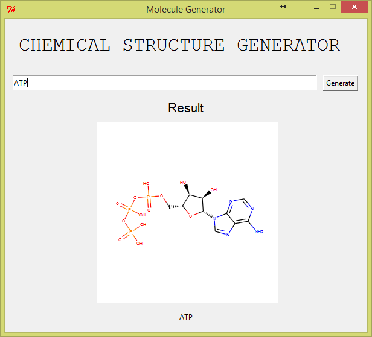
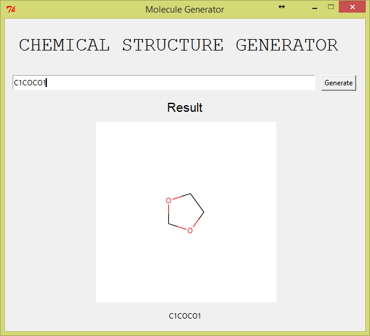

# Simple chemical name to structure generator
**Description:**

This program creates the bond-line structure of organic compound. This  displays complex and simple structures which are be available in the program library that contains about 1200 organic compunds. 

**Requirements:**

RDKIT: http://www.rdkit.org/docs/Install.html

PyCairo: https://cairographics.org/pycairo/

**Sample Output:**

